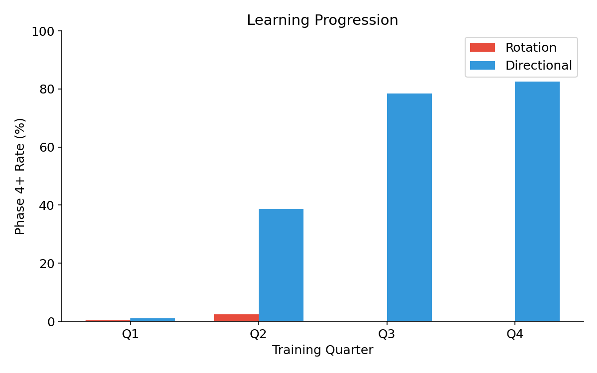
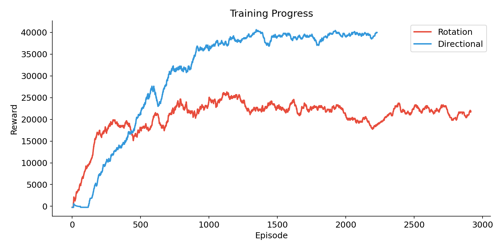
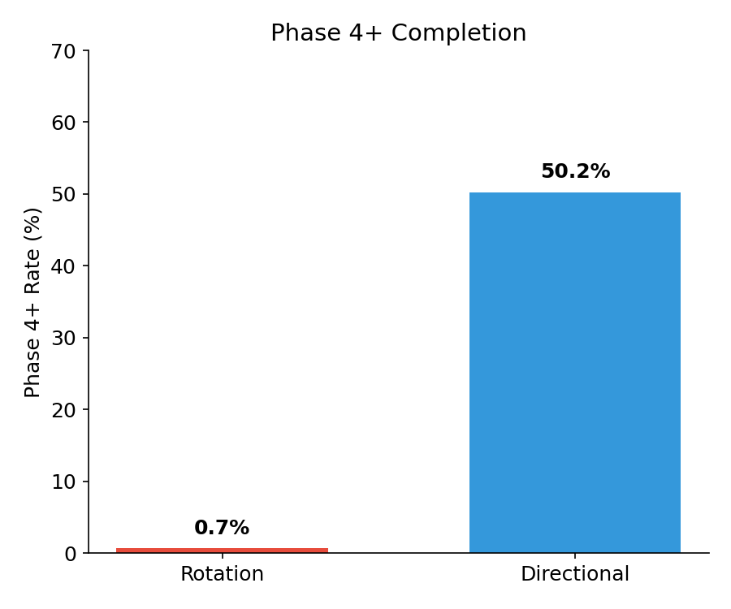

# Reinforcement Learning for Sequential Decision-Making: Tabular Methods in Grid Worlds and Deep RL in Continuous Control Environments

**COSC3145 – Artificial Intelligence**

**Assignment 3 Report**

---

**Abstract** — Reinforcement learning provides a powerful framework for training autonomous agents in dynamic environments. This report investigates reinforcement learning across two fundamentally different problem settings. The first focuses on tabular reinforcement learning in discrete grid world environments, where explicit state-action representations enable analytical comparison of Q-Learning and SARSA learning dynamics. The second examines deep reinforcement learning in a continuous-control arena using Proximal Policy Optimization (PPO), comparing two control schemes—rotation-based and directional movement. Through comparative analysis across 4 million training timesteps, the directional control scheme achieved **50.2% Phase 4+ completion rate** (82.5% in the final training quarter), significantly outperforming the rotation scheme's 0.7% rate. A key finding is that Stable Baselines3 default hyperparameters with zero entropy coefficient provide optimal performance, demonstrating that simpler control schemes with direct action-outcome mappings learn more effectively than complex physics-based controls in this domain. Additionally, a curriculum learning experiment reveals that environmental perturbations during training act as domain randomization, improving directional scheme performance from 33.7% to 46.7% Phase 2+ completion rate at early training stages.

*Keywords* — Reinforcement Learning, Q-Learning, SARSA, Proximal Policy Optimization (PPO), Deep RL, Game AI, Curriculum Learning, Domain Randomization

---

## 1. Introduction

This report investigates reinforcement learning across two fundamentally different problem settings. The first focuses on tabular reinforcement learning in discrete grid world environments, where explicit state-action representations enable analytical comparison of learning dynamics between off-policy (Q-Learning) and on-policy (SARSA) algorithms. The second examines deep reinforcement learning in a continuous-control arena using Proximal Policy Optimization (PPO), including an extension based on curriculum learning.

Reinforcement learning (RL) has emerged as a fundamental approach for training intelligent agents that can make sequential decisions in complex environments. Unlike supervised learning, RL agents learn through interaction with their environment, receiving rewards or penalties based on their actions. This paradigm is particularly well-suited for game AI, where agents must develop strategies through trial and error.

The progression from tabular methods to deep RL illustrates how the field has evolved to handle increasingly complex state and action spaces. Structuring the report around these two tasks enables clearer analysis of algorithmic strengths, limitations, and generalization behavior.

The project is organized into three parts:

(a) **Part 1 (Gridworld)**: Classical RL algorithms (Q-Learning, SARSA) with intrinsic reward mechanisms for exploration in a discrete 10×10 grid environment with seven levels of increasing complexity.

(b) **Part 2 (Deep RL Arena)**: Proximal Policy Optimization (PPO) applied to a continuous space shooter game with two distinct control schemes—rotation-based (Asteroids-style) and directional movement.

(c) **Part 3 (Curriculum Experiment)**: Investigation of how environmental perturbations during training affect agent learning and generalization, comparing standard training against a curriculum with dynamic spawner repositioning.

---

## 2. Tabular Reinforcement Learning (Grid World)

### 2.1 Environment and Entities

The grid world environment is a discrete, episodic domain defined on a fixed 10×10 grid with an action space of 4 discrete actions. The agent begins each episode from a predefined start location and can execute four deterministic actions: up, down, left, and right. The environment includes static obstacles, collectible rewards, hazardous tiles, and stochastic monsters that terminate the episode upon contact.

| Property | Value |
|----------|-------|
| Grid Size | 10×10 cells |
| Cell Size | 60 pixels |
| Max Steps | 200 per episode |
| Action Space | 4 discrete actions (UP, DOWN, LEFT, RIGHT) |
| Training Episodes | 5000 |
| Learning Rate (α) | 0.1 |
| Discount Factor (γ) | 0.99 |
| Epsilon Decay | 1.0 → 0.01 (linear) |

*Table 1. Gridworld environment parameters.*

The gridworld contains several entity types, each with distinct behaviors:

| Entity | Symbol | Behavior |
|--------|--------|----------|
| Empty | . | Passable terrain |
| Rock | R | Impassable obstacle (blocks movement) |
| Fire | F | Instant death on contact |
| Apple | A | Collectible reward item |
| Key | K | Required to unlock chests |
| Chest | C | High-value collectible (requires key) |
| Monster | M | Stochastic movement (40% chance per step), death on contact |

*Table 2. Gridworld entity types and behaviors.*

Seven levels test different aspects of agent learning:

| Level | Name | Purpose | Key Challenge |
|-------|------|---------|---------------|
| 0 | Basic Apples | Q-Learning introduction | Simple pathfinding |
| 1 | Fire Hazards | SARSA demonstration | Navigate around fire |
| 2 | Keys & Chests | Multi-step planning | Collect key before chest |
| 3 | Complex Layout | Multiple objectives | Apples, key, chest with hazards |
| 4 | Monster Intro | Stochastic transitions | Single moving monster |
| 5 | Monster Challenge | High stochasticity | Multiple monsters |
| 6 | Sparse Rewards | Intrinsic motivation | Long path with minimal guidance |

*Table 3. Gridworld level design and purposes.*

### 2.2 Reward Design

| Event | Reward | Purpose |
|-------|--------|---------|
| Apple collection | +1.0 | Primary objective reward |
| Chest opening | +2.0 | High-value objective (requires planning) |
| Key pickup | +0.1 | Subgoal shaping reward |
| Each step | -0.1 | Encourages path efficiency |
| Death (fire/monster) | -10.0 | Strong aversion to hazards |

*Table 4. Gridworld reward structure.*

The current reward design is aimed at achieving optimal pathfinding while encouraging obstacle avoidance. The apple and chest rewards create "small wins" that guide the agent toward objectives. The key reward (+0.1) serves as a signal that picking up keys is beneficial without being the primary goal. The step penalty (-0.1) prevents the agent from wandering aimlessly when no immediate danger exists, forcing it to find efficient paths to rewards. The death penalty is heavily weighted to teach strong hazard avoidance.

### 2.3 Intrinsic Motivation

The intrinsic reward acts as a curiosity signal that motivates the agent to explore the map independently of external objectives, such as collecting apples or chests. This mechanism is particularly effective in sparse reward environments where there is less immediate danger, and exploration often leads to better outcomes. The intrinsic formula is:

```
intrinsic_reward = 1 / √(n(s))
```

Where:
- n(s) = number of visits to the current state during the episode
- total_reward = environment_reward + intrinsic_reward

This formulation gives high rewards for visiting new states and diminishing rewards for revisiting, naturally encouraging exploration of unvisited regions.

### 2.4 Algorithms

Q-Learning and SARSA are evaluated to highlight the difference between off-policy and on-policy learning.

**Q-Learning** [1] is an off-policy algorithm that learns the optimal action-value function Q*(s,a) regardless of the policy being followed:

```
Q(s,a) ← Q(s,a) + α[r + γ·max Q(s',a') - Q(s,a)]
```

**SARSA** (State-Action-Reward-State-Action) [2] is an on-policy algorithm that updates Q-values based on the actual action taken:

```
Q(s,a) ← Q(s,a) + α[r + γ·Q(s',a') - Q(s,a)]
```

The key distinction is that Q-Learning is **optimistic** (assumes optimal future behavior), while SARSA is **conservative** (accounts for exploratory actions). Q-Learning aggressively optimizes expected future return, while SARSA incorporates the agent's current behavior policy, resulting in more conservative learning dynamics.

### 2.5 Results & Observations

The comparison was performed across all four algorithm variants (Q-Learning, SARSA, Q-Learning+Intrinsic, SARSA+Intrinsic) over 5000 episodes. The two base algorithms behave differently according to their theoretical definitions:

**Q-Learning (Aggressive)**: Q-Learning is "off-policy" and generally targets the maximum possible future reward regardless of its current exploratory actions. This manifests as risk-taking behavior where the agent attempts shortcuts even near hazards.

**SARSA (Conservative)**: SARSA is "on-policy," meaning it accounts for the fact that it is still exploring and might make mistakes. This often results in smoother, safer learning curves and policies that maintain distance from hazards.

#### Observations by Level Category

**Simple Levels (0, 1, 6)**: No significant differences between algorithms. Both models handle these environments well, as the state spaces are simple enough for basic epsilon-greedy exploration to succeed. All four algorithms converge to approximately 100% success rate relatively quickly.

**Complex Levels (2, 3)**: Q-Learning outperforms SARSA by finding shortcuts that create significant performance jumps. On the other hand, SARSA produces more stable performance but follows safer, sometimes longer paths. The key-chest mechanic in these levels tests the agent's ability to plan multi-step sequences.

**Monster Levels (4, 5)**: Rewards are significantly lower and noisier due to stochasticity. Any exploratory move into a monster's path leads to massive reward drops. For Level 4 (single monster), all models show steady, linear improvement, suggesting convergence would occur with additional training beyond 5000 episodes. For Level 5 (multiple monsters), all algorithms achieve near-0% success rate after 5000 episodes, indicating that the complexity may exceed what simple tabular RL can overcome without additional techniques.

**Intrinsic Reward Impact**: The intrinsic reward variants slightly outperform base algorithms in exploration-heavy tasks by reducing the time the agent spends wandering around. However, they do not improve performance in challenges requiring complex multi-step analysis, such as the monster levels.

---

## 3. Deep Reinforcement Learning (Arena + Curriculum)

### 3.1 Environment & Action Space

The Deep RL Arena is a space shooter game where the player must destroy enemy spawners across five phases of increasing difficulty. Unlike the discrete gridworld, this environment features continuous movement, real-time physics, and simultaneous multi-entity interactions.

| Property | Value |
|----------|-------|
| Window Size | 960×680 pixels |
| Max Steps | 3000 per episode |
| Phases | 5 (1 to 5 spawners) |
| Action Space (Rotation) | 5 discrete actions |
| Action Space (Directional) | 6 discrete actions |
| Observation Space | 23 continuous features (both schemes) |

*Table 5. Deep RL Arena environment parameters.*

A continuous observation vector provides the agent with all information needed to make decisions:

| Index | Feature | Normalization | Purpose |
|-------|---------|---------------|---------|
| 0-1 | Player position (x, y) | [0, 1] | Spatial awareness |
| 2-3 | Player velocity (vx, vy) | [-1, 1] | Momentum prediction |
| 4-5 | Player angle (cos, sin) | [-1, 1] | Orientation |
| 6-9 | Nearest enemy (dist, cos, sin, speed) | [0, 1] | Threat detection |
| 10-13 | Nearest spawner (dist, cos, sin, facing) | [0, 1] | Target acquisition |
| 14-17 | Health, phase, enemy count, shoot ready | [0, 1] | Game state |
| 18-21 | Wall distances (L, R, T, B) | [0, 1] | Boundary awareness |
| 22 | Active spawner count | [0, 1] | Progress tracking |

*Table 6. Observation vector design for Deep RL Arena (23 features).*

The observation vector is unified across both control schemes, containing 23 normalized features that capture the complete game state. This simplicity proved more effective than scheme-specific observations attempted in earlier experiments.

The phase system increases difficulty progressively:

| Phase | Spawners | Spawn Rate | Enemy Speed |
|-------|----------|------------|-------------|
| 1 | 1 | 1.0× | 1.0× |
| 2 | 2 | 1.2× | 1.1× |
| 3 | 3 | 1.4× | 1.2× |
| 4 | 4 | 1.6× | 1.3× |
| 5 | 5 | 2.0× | 1.5× |

*Table 7. Phase progression difficulty scaling.*

### 3.2 PPO Algorithm

Proximal Policy Optimization (PPO) [3] addresses the challenge of policy gradient methods in continuous spaces. PPO uses a clipped surrogate objective to ensure stable policy updates:

```
L(θ) = E[min(r(θ)·A, clip(r(θ), 1-ε, 1+ε)·A)]
```

where r(θ) is the probability ratio between new and old policies, and A is the advantage estimate. This approach has become a standard algorithm for continuous control tasks due to its stability and sample efficiency.

PPO is used with Stable Baselines3 [6] default hyperparameters, which proved optimal after extensive experimentation:

| Parameter | Value |
|-----------|-------|
| Total Timesteps | 4,000,000 |
| Learning Rate | 3e-4 |
| n_steps | 2048 |
| Batch Size | 64 |
| n_epochs | 10 |
| Gamma | 0.99 |
| GAE Lambda | 0.95 |
| Clip Range | 0.2 |
| Network | [64, 64] MLP |
| Entropy Coefficient | **0.0** |

*Table 8. PPO hyperparameters (SB3 defaults).*

A key finding from experimentation is that **SB3 default hyperparameters with zero entropy coefficient** provide optimal performance. Earlier experiments with custom hyperparameters (lr=1e-4, ent_coef=0.02, network=[256,256]) showed faster initial learning but suffered from policy oscillation and regression. The deterministic policy (entropy=0.0) allows clean convergence for both control schemes.

### 3.3 Control Scheme Comparison

Two control schemes are implemented to compare different movement paradigms:

**Rotation Scheme (5 actions)**: Asteroids-style movement with momentum. Actions are no_action, thrust, rotate_left, rotate_right, and shoot. The player maintains velocity with friction (0.98) and must orient before thrusting. This creates a **two-step control problem**: first orient toward the target, then act. The gun fires in the direction the ship faces.

**Directional Scheme (6 actions)**: Direct 4-way movement where the gun always fires upward. Actions are no_action, up, down, left, right, and shoot. Movement is more direct with higher effective friction (0.8), creating a simpler **one-step positioning problem**: move to align with target vertically, then shoot.

| Action | Rotation Scheme | Directional Scheme |
|--------|-----------------|-------------------|
| 0 | No Action (drift) | No Action (stop) |
| 1 | Thrust (accelerate forward) | Move Up |
| 2 | Rotate Left | Move Down |
| 3 | Rotate Right | Move Left |
| 4 | Shoot | Move Right |
| 5 | - | Shoot |

*Table 9. Action definitions for both control schemes.*

#### Reward Structure

| Event | Reward | Rationale |
|-------|--------|-----------|
| Destroy enemy | +10 | Immediate tactical reward |
| Destroy spawner | +80 | Primary objective |
| Hit spawner | +5 | Shaping for partial progress |
| **Phase complete** | **+10,000** (flat) | Major milestone reward |
| **Victory bonus** | **+100,000** | Strong completion incentive |
| Take damage | -5 | Mild aversion to damage |
| Death | -200 | Strong failure penalty |
| Survival tick | +0.01 | Encourages staying alive |

*Table 10. Deep RL Arena reward structure.*

The reward structure uses **flat phase rewards** (+10,000 per phase) rather than scaled rewards. Experiments showed that scaled rewards (10k, 20k, 30k, etc.) inadvertently taught conservative play—agents learned to protect Phase 3 completion rather than risk it for Phase 4. Flat rewards create consistent incentives for progression, while the large victory bonus (+100,000) provides strong motivation to complete all phases.

Total possible reward from phases plus victory bonus: **150,000** (50k from phases + 100k victory).

### 3.4 Results & Analysis

#### 3.4.1 Training Results

Training was conducted on Kaggle GPU instances for approximately 4 hours per scheme (4M timesteps). Results demonstrate significant performance differences between schemes:

| Metric | Rotation | Directional |
|--------|----------|-------------|
| Episodes | 2,916 | 2,230 |
| Mean Reward | 20,760 | **30,625** |
| Std Reward | 12,493 | 13,403 |
| Max Reward | 41,406 | 41,896 |
| Min Reward | -237 | -237 |
| Mean Episode Length | 1,372 | 1,728 |
| Phase 2+ Rate | 82.5% | 83.5% |
| Phase 3+ Rate | 23.4% | **72.2%** |
| **Phase 4+ Rate** | 0.7% | **50.2%** |
| Phase 5 Rate | 0.0% | 0.0% |
| Death Rate | 0.7% | 7.1% |

*Table 11. Training results (4M timesteps, SB3 default hyperparameters).*

The directional scheme significantly outperforms rotation, achieving **50.2% Phase 4+ completion rate** compared to rotation's 0.7%. While directional has a higher death rate (7.1% vs 0.7%), this reflects a more aggressive strategy that pays off in higher phase completion.

#### Learning Progression Analysis

The directional scheme shows dramatic improvement throughout training, while rotation plateaus early:

| Quarter | Rotation Phase 4+ | Directional Phase 4+ |
|---------|-------------------|----------------------|
| Q1 (0-25%) | 0.4% | 1.1% |
| Q2 (25-50%) | 2.3% | 38.8% |
| Q3 (50-75%) | 0.0% | 78.5% |
| Q4 (75-100%) | 0.0% | **82.5%** |

*Table 12. Learning progression by training quarter.*

The directional scheme demonstrates continuous improvement, reaching **82.5% Phase 4+ rate in the final quarter**—a 75× improvement over Q1. In contrast, the rotation scheme shows minimal learning beyond Phase 2 completion.


*Figure 1. Phase 4+ completion rate over training episodes.*


*Figure 2. Phase 4+ rate by training quarter.*

#### 3.4.2 Discussion and Analysis

**Why Directional Outperforms Rotation**

The directional scheme's superior performance stems from its simpler control mapping:

| Aspect | Rotation | Directional |
|--------|----------|-------------|
| Aiming | Must rotate to face target | Gun always shoots up |
| Movement | Thrust in facing direction | Direct 4-way movement |
| Physics | Momentum (friction=0.98) | Quick stop (friction=0.8) |
| Control complexity | 2-step: orient → act | 1-step: position → shoot |
| Credit assignment | Delayed (rotation → thrust → outcome) | Direct (position → shoot → outcome) |

*Table 13. Control scheme complexity comparison.*

The rotation scheme requires the agent to:
1. Learn that orientation matters
2. Learn how to orient efficiently
3. Learn how thrust creates movement in the facing direction
4. Learn to coordinate orientation with shooting

This multi-step credit assignment problem is significantly harder than the directional scheme's direct mapping: "move below spawner → shoot up → destroy spawner."

**The SB3 Default Advantage**

Extensive hyperparameter experimentation revealed that SB3 defaults outperform custom configurations:

| Configuration | Early Learning | Peak Performance | Stability |
|--------------|----------------|------------------|-----------|
| Custom (ent=0.02, lr=1e-4) | Fast (26% Phase 4 by ep 270) | 62.5% Phase 4 | Oscillates, regresses |
| SB3 Default (ent=0.0, lr=3e-4) | Slow (0% Phase 4 by ep 270) | **82.5% Phase 4** | Stable, continuous |

*Table 14. Hyperparameter configuration comparison.*

The zero entropy coefficient allows the policy to converge cleanly without exploration noise disrupting learned behaviors. Higher entropy (0.02) enables faster initial learning but prevents stable convergence.

**Phase 5 Difficulty Wall**

No agents across 5,000+ episodes achieved Phase 5 completion (0% rate). Maximum rewards cluster around ~41,000 (Phase 4 ceiling). Phase 5 presents extreme challenges:
- 5 simultaneous spawners
- 2× spawn rate
- 1.5× enemy speed

The jump from 4 to 5 spawners appears to exceed the agent's learned strategies.

### 3.5 Curriculum Training (Domain Randomization)

#### Hypothesis

The experiment tests whether environmental perturbations during training help or hinder agent learning. The initial hypothesis was that randomly repositioning spawners mid-episode would **disrupt learning** by invalidating the agent's learned spatial strategies.

#### Curriculum Design

The curriculum condition introduces spawner repositioning with the following parameters:

| Parameter | Value |
|-----------|-------|
| Check Interval | Every 500 steps |
| Reposition Probability | 30% per check |
| Min Distance from Player | 200 pixels |
| Min Distance between Spawners | 150 pixels |

*Table 15. Curriculum spawner repositioning parameters.*

When triggered, active spawners teleport to new random positions that satisfy the minimum distance constraints, preventing exploitation of memorized spawner locations.

#### Experimental Setup

Four conditions are compared:
- Rotation Control (standard environment)
- Rotation Curriculum (with repositioning)
- Directional Control (standard environment)
- Directional Curriculum (with repositioning)

Each condition uses 500k timesteps to compare early learning dynamics.

### 3.6 Curriculum Training Results & Analysis

#### 3.6.1 Results

Contrary to the initial hypothesis, the curriculum condition **improved** performance for the directional scheme:

| Metric | Rotation Control | Rotation Curriculum |
|--------|------------------|---------------------|
| Episodes | 291 | 273 |
| Mean Reward | 4,594 | **7,449** |
| Max Reward | 20,168 | 20,244 |
| Phase 2+ Rate | 1.2% | **5.1%** |
| Phase 3+ Rate | 0.0% | 0.0% |
| Positive Reward Rate | 3.7% | **31.5%** |

*Table 16. Rotation: Control vs Curriculum (500k timesteps).*

| Metric | Directional Control | Directional Curriculum |
|--------|---------------------|------------------------|
| Episodes | 263 | 272 |
| Mean Reward | 10,745 | **13,192** |
| Max Reward | 30,892 | 31,284 |
| Phase 2+ Rate | 33.7% | **46.7%** |
| Phase 3+ Rate | 6.4% | **11.0%** |
| Positive Reward Rate | 47.4% | **63.8%** |

*Table 17. Directional: Control vs Curriculum (500k timesteps).*

Key improvements from curriculum:
- **Rotation**: +62% mean reward, +28 percentage points positive episode rate
- **Directional**: +23% mean reward, +13 percentage points Phase 2+ rate

#### 3.6.2 Discussion and Analysis

**Curriculum Acts as Domain Randomization**

The curriculum condition provides unexpected benefits by acting as **domain randomization**:

1. **Prevents overfitting**: Agents cannot memorize specific trajectories or spawner positions
2. **Encourages generalization**: Policies must work for any spawner configuration
3. **Improves robustness**: Learned behaviors transfer to novel situations

**Why Curriculum Helps Both Schemes**

Unlike the full 4M timestep experiments where rotation struggled regardless of curriculum, at 500k timesteps both schemes benefit:

- The perturbations prevent early convergence to suboptimal local minima
- Agents learn more general "approach and destroy" behaviors rather than position-specific strategies
- The randomization provides implicit exploration without requiring entropy

**Connection to Domain Randomization Literature**

These results align with domain randomization research from robotics [5], where training with environmental variations produces policies that generalize better. The spawner repositioning curriculum inadvertently implemented this principle, demonstrating that "harder training makes easier testing."

---

## 4. Conclusion

This report demonstrates how reinforcement learning techniques must be adapted to the structure of the problem domain. Tabular methods provide valuable insight into learning dynamics but scale poorly to complex environments, while deep reinforcement learning enables effective control in continuous state spaces.

**Key achievements:**

1. Successful implementation of Q-Learning and SARSA with intrinsic rewards for gridworld navigation, demonstrating the theoretical distinction between off-policy (aggressive) and on-policy (conservative) learning in practice.

2. Development of a Deep RL Arena with two control schemes trained using PPO, achieving **50.2% Phase 4+ completion rate** (82.5% in Q4) with the directional scheme using SB3 default hyperparameters.

3. Discovery that **simpler control schemes learn more effectively**—the directional scheme's one-step position-to-action mapping dramatically outperforms the rotation scheme's two-step orientation-then-action approach.

4. Demonstration that **SB3 default hyperparameters with zero entropy** provide optimal performance, outperforming custom configurations that showed faster initial learning but suffered from instability.

5. Confirmation that **flat reward structures** (equal rewards per phase) encourage continuous progression, while scaled rewards inadvertently teach conservative play.

6. Validation that **environmental perturbations act as domain randomization**, improving early learning for both control schemes by preventing overfitting to specific configurations.

7. Intrinsic reward mechanisms improve exploration in sparse reward environments by providing curiosity-driven bonuses for visiting novel states.

**Limitations:**

- Computational constraints limited curriculum experiments to 500k timesteps
- Single random seed results; multiple seeds would provide confidence intervals
- Phase 5 completion remains elusive (0% across all experiments)
- Rotation scheme struggled to exceed Phase 2 performance
- Monster levels in gridworld proved too challenging for tabular methods

**Future work** could explore:
- Extended training runs targeting Phase 5 completion
- Hierarchical RL approaches for the rotation scheme's multi-step control problem
- Progressive curriculum learning with gradual difficulty increases
- Multi-agent training with cooperative or competitive dynamics
- More sophisticated exploration mechanisms for high-stochasticity environments

The project provides practical insights for applying reinforcement learning to game AI, particularly the finding that **control scheme simplicity trumps flexibility**—direct action-outcome mappings enable faster and more reliable learning than physics-based controls requiring multi-step coordination.

---

## 5. References

[1] Watkins, C. J., & Dayan, P. (1992). Q-learning. Machine learning, 8(3), 279-292.

[2] Rummery, G. A., & Niranjan, M. (1994). On-line Q-learning using connectionist systems. Cambridge University Engineering Department.

[3] Schulman, J., Wolski, F., Dhariwal, P., Radford, A., & Klimov, O. (2017). Proximal policy optimization algorithms. arXiv preprint arXiv:1707.06347.

[4] Pathak, D., Agrawal, P., Efros, A. A., & Darrell, T. (2017). Curiosity-driven exploration by self-supervised prediction. International Conference on Machine Learning (ICML).

[5] Tobin, J., Fong, R., Ray, A., Schneider, J., Zaremba, W., & Abbeel, P. (2017). Domain randomization for transferring deep neural networks from simulation to the real world. IEEE/RSJ International Conference on Intelligent Robots and Systems (IROS).

[6] Raffin, A., Hill, A., Gleave, A., Kanervisto, A., Ernestus, M., & Dormann, N. (2021). Stable-Baselines3: Reliable Reinforcement Learning Implementations. Journal of Machine Learning Research (JMLR).

[7] Sutton, R. S., & Barto, A. G. (2018). Reinforcement learning: An introduction (2nd ed.). MIT Press.

[8] Mnih, V., Kavukcuoglu, K., Silver, D., et al. (2015). Human-level control through deep reinforcement learning. Nature, 518(7540), 529-533.

---

## 6. Appendix

### A. Q-Learning and SARSA Update Rules

**Q-Learning (Off-Policy)**:
```
Q(s,a) ← Q(s,a) + α × [r + γ × max_a' Q(s',a') - Q(s,a)]
```
The max operator selects the best possible action in the next state, regardless of what action the agent actually takes.

**SARSA (On-Policy)**:
```
Q(s,a) ← Q(s,a) + α × [r + γ × Q(s',a') - Q(s,a)]
```
Uses the actual next action a' that the policy selects, including exploratory actions.

### B. PPO Algorithm

```
for iteration = 1, 2, ... do
    for actor = 1, 2, ..., N do
        Run policy π_old in environment for T timesteps
        Compute advantage estimates A_1, ..., A_T
    end for

    Optimize surrogate L w.r.t. θ, with K epochs and minibatch size M:
        L(θ) = E[min(r(θ)A, clip(r(θ), 1-ε, 1+ε)A)]

    θ_old ← θ
end for
```

*Figure A1. PPO algorithm pseudocode.*

### C. Observation Vector Summary

**Both Schemes (23 features)**:
- Player state: x, y, vx, vy, cos(angle), sin(angle) [6]
- Nearest enemy: distance, cos, sin, speed [4]
- Nearest spawner: distance, cos, sin, facing_cos [4]
- Game state: health, phase, enemy_count, shoot_ready [4]
- Wall distances: left, right, top, bottom [4]
- Active spawner count [1]

### D. Hyperparameter Experiments Summary

| Version | Key Change | Directional Phase 4+ |
|---------|------------|---------------------|
| Ver 4_4k | Custom params (ent=0.02) | 49.6% (oscillated) |
| Default_4k | SB3 defaults (ent=0.0) | **50.2%** (82.5% Q4) |
| Ver 5 | Added turn_direction | 1.2% (regression) |
| Ver 6 | Scheme-specific entropy | 31.0% |
| Ver 7 | Scheme-specific observations | 20.7% |

*Table A1. Training version progression showing Default_4k as optimal.*

The key finding is that simpler configurations (SB3 defaults, unified observations) outperform more complex scheme-specific tuning. The directional scheme benefits from deterministic policies that can converge cleanly.

### E. Training Curves


*Figure A2. Episode reward over training (50-episode moving average).*


*Figure A3. Phase 4+ completion rate comparison between schemes.*

### F. Curriculum Experiment Details

The curriculum experiment tested whether mid-episode environment perturbations help or hinder learning:

| Condition | Phase 2+ | Mean Reward | Change from Control |
|-----------|----------|-------------|---------------------|
| Rotation Control | 1.2% | 4,594 | - |
| Rotation Curriculum | 5.1% | 7,449 | +62% reward |
| Directional Control | 33.7% | 10,745 | - |
| Directional Curriculum | 46.7% | 13,192 | +23% reward |

*Table A2. Curriculum experiment results (500k timesteps).*

Both schemes showed improved early learning with curriculum, suggesting domain randomization benefits extend to game AI training.
